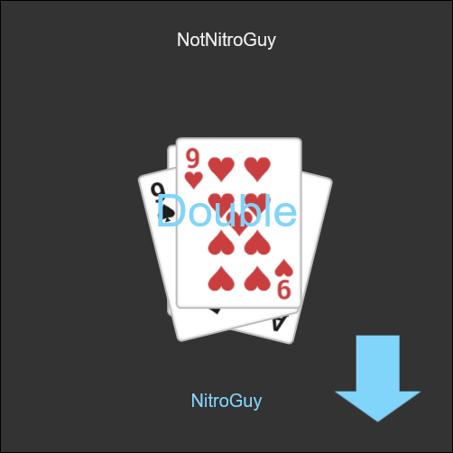

# ERS-OL

Play [Egyptian Rat Screw](https://bicyclecards.com/how-to-play/egyptian-rat-screw/) online with your friends.

Egyptian Rat Screw (ERS) is my favorite card game (and I'm pretty good at it if I do say so myself).
Unfortunately, it really doesn't translate well to an online game.
There's arguing, mind games, memorization, and most importantly violently slapping the card pile at very precise times.

I said screw all that and let's make an online version of it anyway.



## Dependencies and "Dependencies"

This game uses some AWESOME AND SUPER USEFUL public domain (CC0) playing card sprites from Kenney[]().nl
https://opengameart.org/content/boardgame-pack

On the client side of things, the networking stuff is done with [Socket.IO](https://socket.io/) WHICH I LOVE AND IS AN INVALUABLE RESOURCE, and [howler.js](https://howlerjs.com/) which I've never used before and I barely scratch the surface of in this project.
These are included in the repository and you don't need to download them yourself.

On the server side, it's mostly all [Socket.IO](https://github.com/miguelgrinberg/python-socketio) again (but this time in Python) and the other dependencies can be found in requirements.txt

## Install and Run

You'll need [Python 3](https://www.python.org/)

```
# Clone the repository with git (or do it your own way)
git clone https://github.com/NitroGuy10/ERS-OL

# Create a virtual environment
python3 -m venv venv

# Activate it (Windows)
venv\Scripts\activate.bat

# Activate it (Mac/Linux)
source venv/bin/activate

# Install the requirements
pip3 install -r requirements.txt
```

If you actually plan to properly host this as on a proper server... you probably know what you're doing and don't need my help lol. main.[]()py is what you're looking for. Go crazy.

If you just want to run this game and play it with your friends:
```
python3 main.py
```
Boom, the server is running. Now if you want to play it, open your favorite browser and tell your friends to open theirs.
There are a few URLs you can try:
```
# If you just wanna test it on your own machine
localhost:25565

# If you wanna play it over LAN, use your local ipv4 address
# You can search online if you don't know how to do this
# It should be something like 192.168.0.17
<your local ipv4 address>:25565

# If you wanna play it over the internet, use your external ip address
# Search "my ipv4" online and find a website that'll tell you what it is
# It should be something like ##.###.##.### ...if it's waaay longer then you've probably found your ipv6 instead
# You'll also have to port forward port 25565
# This process is different for every router manufacturer so all I can say is good luck and the internet is your friend
<your external ipv4 address>:25565
```

If you want to change the port for some reason, you can can edit the line that says `app.run(host="0.0.0.0", port=25565)` at the bottom of main.[]()py

The first player that joins a given lobby is the host. Enjoy!

## Epilogue

I'm sooooooooo proud of this game.
I've never come close to doing a project involving networking at this scale or even at all.
It took me an unprecidented amount of time and effort to complete it and I really am very happy with the final product... if it weren't for the ping.

*\*sigh\** yeah... in practice this game is rather unplayable over the internet because the ping gives the host a massive advantage.
Actually, this game runs quite well if played over LAN, but if you're able to play this over LAN, THEN WHY NOT JUST PLAY THE ACTUAL CARD GAME AHAHHAHAHAH.

Despite all that, I'm really happy I was able to finish this project.
At the very least, it reassured me that game development is not the career path for me :P
